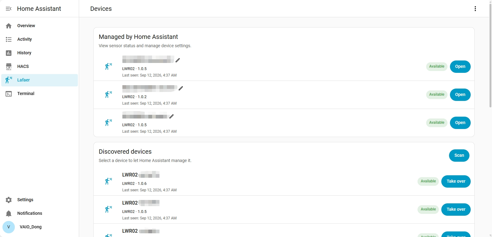
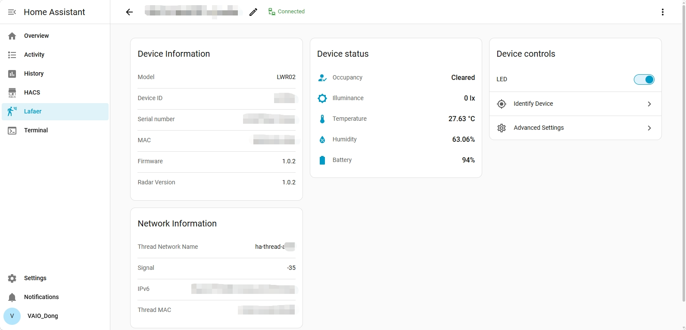
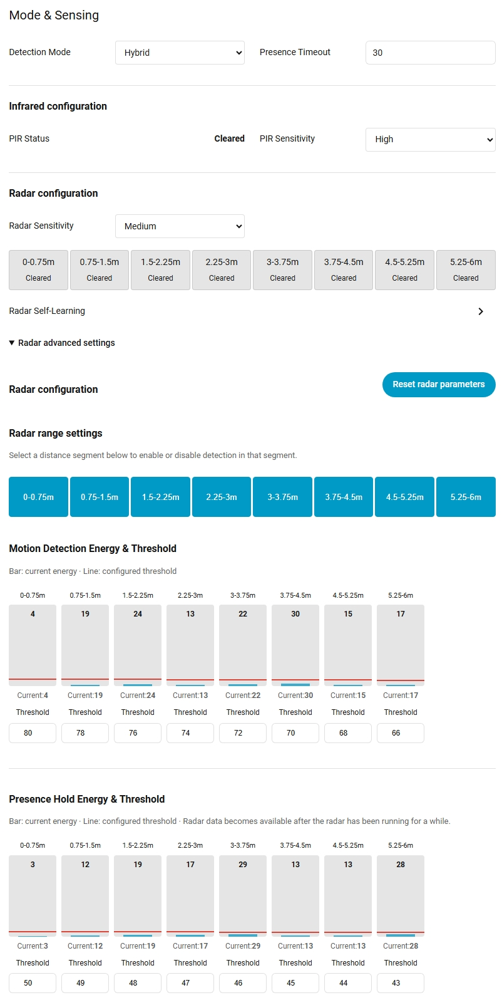

# ha-lafaer

Manage Lafaer LWR01 and LWR02 presence sensors directly from Home Assistant.
View readings, control the LED, and fine-tune detection from a dedicated sidebar
panel.

## Features

- Discover, take over, rename, and manage supported sensors.
- View presence, illuminance, battery level, and device information.
- View temperature and humidity on LWR02, or power source on LWR01.
- Adjust detection mode, sensitivity, presence timeout, and low-light reporting,
  depending on the model.
- Configure LWR02 radar distance segments and thresholds with live energy charts.
- Run radar self-learning, identify a device, and reset settings.
- View debug information and optionally record logs.
- English, Simplified Chinese, and Traditional Chinese, following your Home
  Assistant language. Other languages fall back to English.

This is a configuration and status panel. It does **not** provide continuously
updated entities for dashboards or automations. Continue using your Matter
integration for those features where supported by the device. Firmware updates
are not included.

## Requirements

- Home Assistant with support for custom integrations. The declared minimum
  version is **2024.12.0**; using a current supported release is recommended.
- Lafaer **LWR01** or **LWR02**, already connected to a Thread network.
- A **Thread Border Router** and IPv6 connectivity from Home Assistant to the
  sensor. Automatic discovery also requires mDNS access.

The integration does not add devices to a Thread network. Your phone or browser
does not need to be near the sensor; connectivity from Home Assistant is what
matters.

## Installation

### HACS

1. Open HACS and select **Custom repositories** from its menu.
2. Add `https://github.com/VAIO-Dong/ha-lafaer` with type **Integration**.
3. Find **Lafaer** and download it.
4. Restart Home Assistant.
5. Open **Settings → Devices & services → Add integration**, search for
   **Lafaer**, and complete setup.
6. Open **Lafaer** in the sidebar.

If HACS does not offer a download, use the manual installation below.

### Manual installation

1. Download this repository.
2. Copy `custom_components/lafaer` into your Home Assistant configuration
   directory. The resulting path should be
   `/config/custom_components/lafaer/manifest.json`.
3. Restart Home Assistant.
4. Add **Lafaer** under **Settings → Devices & services**, then open it in the
   sidebar.

To update, download through HACS or replace the integration files, restart Home
Assistant, and refresh the browser.

## Getting started

### Add a sensor

The device list separates managed sensors from newly discovered devices.
Choose **Take over** to add a sensor, or **Scan** to search again. Manual
takeover is available in the top-right menu.

> **App management and Home Assistant management are mutually exclusive.**
> A sensor can store only one management key. Taking it over replaces the App
> key, so the App can no longer manage it. Pairing through the App again
> invalidates Home Assistant's key.

Availability reflects the latest discovery result. Check **Last seen** if a
device appears available but cannot be opened.

### View readings and control a device

Open a managed sensor to see its information and current readings.

| Model | Readings |
| --- | --- |
| LWR01 | Presence, illuminance, power source, and battery level when available |
| LWR02 | Presence, illuminance, temperature, humidity, and battery level |

The overview also provides the LED switch, **Identify Device**, and
**Advanced Settings**. Use the edit icon beside the name to rename the device
in this panel.

### Adjust detection

Open **Advanced Settings** to change the available device and detection
settings. On LWR02, PIR-only mode shows infrared settings, radar-only mode shows
radar settings, and hybrid mode provides both.

Expand **Radar advanced settings** to configure distance segments and energy
thresholds. Click a distance segment to enable or disable detection in that
segment. In the charts, bars show current energy and horizontal lines show
configured thresholds.

Selecting a sensitivity preset fills the corresponding thresholds. Editing a
threshold changes the selection to **Custom**. Use the **Save** button for the
settings group to apply changes.

View infrared and radar settings

Screenshots show LWR02. Available settings vary by model and firmware.

## Important notes

- **Battery use:** the panel connects only when needed for management. Hiding the
  browser tab pauses updates; after one minute, an unused connection is closed.
  Returning may take a few seconds to reconnect.
- **Self-learning:** after starting, leave the detection area within the
  30-second countdown. Wait for the completion notification before adjusting
  settings.
- **Energy charts:** presence-hold energy can take time to appear while the
  radar is running.
- **Reset radar parameters** takes effect immediately. Device removal and
  factory reset are available in the top-right menu and require confirmation.
- Removing a device from this panel does not remove it from your Matter
  controller.
- This is a custom integration. Check detection behavior after changing
  settings before relying on it for important automations.

## Troubleshooting

**The sidebar entry is missing:** make sure you added the integration after
installing its files. Restart Home Assistant and refresh your browser.

**No devices are found:** check that mDNS discovery can reach Home Assistant,
especially across VLANs or container networks.

**A device is found but cannot connect:** check Home Assistant's IPv6 route to
the sensor and access to UDP port **5683**. Being reachable from another Matter
controller does not guarantee it is reachable from Home Assistant. Also check
whether the App has taken over management again.

**Need help with an error?**

1. In **Settings → Devices & services → Lafaer**, enable debug logging from the
   integration menu.
2. Reproduce the issue, then disable debug logging to download the log.
3. Open a [GitHub issue](https://github.com/VAIO-Dong/ha-lafaer/issues) with your
   Home Assistant and integration versions, sensor model and firmware, steps
   to reproduce, and relevant logs.

Logs are available under **Settings → System → Logs → Home Assistant Core**.
The panel's top-right menu also offers a **Debug** view, and persistent recording
can be enabled in the integration options.

Review attachments before posting. Do not share passwords, management keys,
tokens, or your full Home Assistant configuration.

## License and trademarks

The integration code is licensed under [Apache-2.0](LICENSE).
Lafaer and Home Assistant names and trademarks belong to their respective owners
and are used here to identify compatible products. This project's license does
not grant rights to those trademarks.
